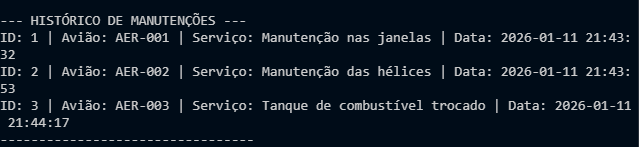
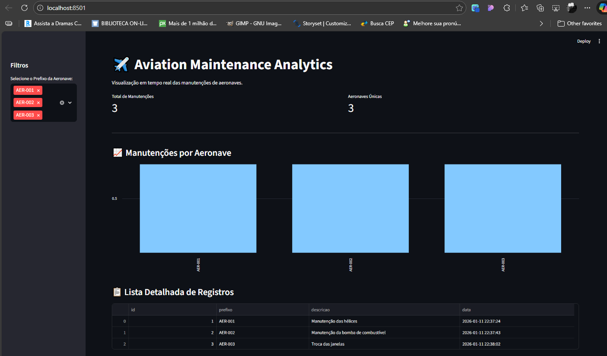

# ✈️Aviation Maintenance Log
 - Scripts em Python e Queries SQL pensando em problemas  relacionados com aviação e logística.
## O objetivo desse script é a criação de um registro para o acompanhamento da frequência de manutenção das aeronaves de uma companhia aérea.
- As informações registradas são o modelo por prefixo, no caso escolhi o prefixo AER-NúmeroAeronave e a manutenção que foi realizada. Mas isso poderia ser alterado por outras necessidades de registor, como compras, registro de problemas apresentados.
  1. A opção 1 é para adicionar o prefixo da aeronave.
  2. Opção 2 é para apresentar o histórico já registrado.
  3. Opção 3 é para sair do programa.
   
 ### Código em python funcionando no VSCode

### Listando histórico de registros

### Registro efetuado com sucesso no banco de dados

### Print do Registro que é apresentado no banco de dados

### Dashboard Simples dos Dados Registrados

- Agora foram adicionados os campos data e status. Os registros ficam conforme a imagem abaixo:

### Print do Registro completo, com data e status no banco de dados
